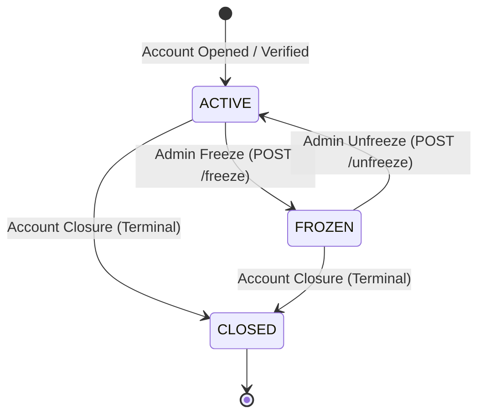
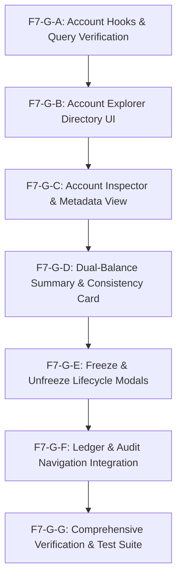

# PHASE F7-G GAP ANALYSIS
## Admin Account Governance & Balance Verification

**Project**: Distributed Payment & Ledger Platform  
**Phase**: F7-G — Admin Account Governance  
**Document Status**: `F7-G_GAP_ANALYSIS_READY`  
**Backend Reference**: Frozen Spring Boot 3.3.4 Production Backend (`payment-ledger-platform-complete-agent-kit`)  
**Frontend Reference**: Next.js 14 + React 18 + TypeScript + TanStack Query (`distributed-payment-platform-ui-complete-agent-kit`)  
**Timestamp**: 2026-09-26  

---

## 1. Executive Summary

Phase F7-G encompasses **Administrative Account Governance & Balance Verification**. The primary purpose of this phase is to provide authorized administrators (`ROLE_ADMIN`, `ROLE_SYSTEM`) with exhaustive operational tools to search, list, inspect, audit, freeze, and unfreeze ledger accounts across all platform tenants.

This gap analysis is performed under a strict **backend-contract-first, zero-assumption policy**. The Spring Boot backend source code serves as the authoritative source of truth.

### Key Findings:
1. **Verified Endpoint Footprint**: The frozen backend exposes exactly **five (5) administrative account endpoints** in `AdminAccountController.java` mapped to `/api/v1/admin/accounts/**`.
2. **Read vs. Mutation Segregation**:
   - **Read-Only**: Account directory listing (`GET /api/v1/admin/accounts`), account detail inspection (`GET /api/v1/admin/accounts/{id}`), and dual-balance consistency audit (`GET /api/v1/admin/accounts/{id}/balance-summary`).
   - **Safe Operational Lifecycle Mutation**: Account freeze (`POST /api/v1/admin/accounts/{id}/freeze`) and account unfreeze (`POST /api/v1/admin/accounts/{id}/unfreeze`).
   - **Financial Mutation**: `AdminAccountController` has **zero** financial mutation or balance adjustment endpoints. Financial balance adjustments strictly reside in `AdminAdjustmentController.java` (`POST /api/v1/admin/adjustments`) and belong to Phase F7-H.
3. **Dual-Balance Authority Architecture**:
   - The platform strictly separates cached materialized balances (`materializedBalanceMinor` in `AccountEntity`) from authoritative immutable double-entry ledger sums (`calculateLedgerBalanceMinor(accountId)` in `LedgerEntryRepository`).
   - The backend provides a dedicated endpoint (`/balance-summary`) computing `differenceMinor` and `isConsistent`. The frontend must **never** calculate balances or verify mathematical consistency in JavaScript; it must render backend-audited figures losslessly.
4. **Concurrency & Audit Rigor**:
   - Account state transitions (freeze/unfreeze) execute under PostgreSQL pessimistic row-level write locks (`findByIdForUpdate`) and write immutable audit records to `admin_audit_logs` via `AdminAuditService`.
5. **Existing Frontend Asset Readiness**:
   - Phase F7-B established typed DTOs in `src/types/admin.ts`, API client methods in `src/lib/api/endpoints/admin-api.ts`, and query keys in `src/features/admin/hooks/query-keys.ts`.
   - The route directory `src/app/(admin)/admin/accounts/` is initialized and currently empty (holding only `.gitkeep`), ready for implementation upon approval.

---

## 2. Frozen Baseline

The distributed payment platform operates under a strictly frozen baseline. No modifications to previous phases or backend codebases are permitted:

| Phase | Description | Status |
| :--- | :--- | :--- |
| **F0** | Architecture, Tooling, Bootstrap, Design Tokens | **COMPLETE & FROZEN** |
| **F1** | Authentication, Session, In-Memory JWT, Token Refresh | **COMPLETE & FROZEN** |
| **F2** | Accounts, Customer Dashboard (`/api/v1/accounts/{id}`) | **COMPLETE & FROZEN** |
| **F3** | Payments, Idempotency, Outbox Lifecycle | **COMPLETE & FROZEN** |
| **F4** | Customer Ledger (Blocked by Backend Design) | **BLOCKED BY FROZEN BACKEND** |
| **F5** | Refunds, Reversals, Payouts | **COMPLETE & FROZEN** |
| **F6** | Customer Reconciliation (Blocked by Backend Design) | **BLOCKED BY FROZEN BACKEND** |
| **F7-A** | Admin Shell, Layout, Navigation, RBAC Guard | **COMPLETE & FROZEN** |
| **F7-B** | Admin API Client Contract Layer, Typed DTOs, Query Keys | **COMPLETE & FROZEN** |
| **F7-C** | Admin KPI Dashboard, Metrics Cards, System Health | **COMPLETE & FROZEN** |
| **F7-D** | Admin Payment Explorer, Filtering, Pagination | **COMPLETE & FROZEN** |
| **F7-E** | Payment Forensic Investigation, Outbox/Kafka Trace | **COMPLETE & FROZEN** |
| **F7-F** | Standalone Ledger Exploration, Journal & Entry Explorer | **COMPLETE & FROZEN (`F7-F_READY_FOR_FREEZE`)** |
| **Backend** | Spring Boot 3.3.4 + PostgreSQL + Kafka + Redis | **PERMANENTLY FROZEN** |

---

## 3. Backend Endpoint Inventory

All five (5) administrative account endpoints reside in `AdminAccountController.java` (`com.paymentledger.admin.api.AdminAccountController`). Each method is protected with `@PreAuthorize("hasAnyRole('ADMIN', 'SYSTEM')")`.

```
Base URL: /api/v1/admin/accounts
```

### Group A: Read-Only Endpoints

#### 1. Administrative Account Directory
- **Method**: `GET`
- **Path**: `/api/v1/admin/accounts`
- **Security**: `@PreAuthorize("hasAnyRole('ADMIN', 'SYSTEM')")`
- **Path Parameters**: None
- **Query Parameters**:
  - `ownerId` (`UUID`, optional) — Filter by account owner UUID
  - `accountType` (`AccountType`, optional) — Filter by enum (`CUSTOMER`, `MERCHANT`, `INTERNAL`, `SYSTEM`)
  - `status` (`AccountStatus`, optional) — Filter by enum (`ACTIVE`, `FROZEN`, `CLOSED`)
  - `page` (`int`, optional, default 0, 0-indexed)
  - `size` (`int`, optional, default 20, clamped between 1 and 100)
  - `sort` (`string`, optional, default `createdAt,desc`)
- **Request Body**: None
- **Success Status**: `200 OK`
- **Response DTO**: `Page<AccountAdminResponse>`
- **Error Statuses**: `401 Unauthorized`, `403 Forbidden`, `400 Bad Request` (invalid UUID format or invalid enum string)
- **Financial Side Effects**: None (Pure Read-Only)

#### 2. Administrative Account Detail Inspector
- **Method**: `GET`
- **Path**: `/api/v1/admin/accounts/{accountId}`
- **Security**: `@PreAuthorize("hasAnyRole('ADMIN', 'SYSTEM')")`
- **Path Parameters**: `accountId` (`UUID`, required)
- **Query Parameters**: None
- **Request Body**: None
- **Success Status**: `200 OK`
- **Response DTO**: `AccountAdminResponse`
- **Error Statuses**: `401 Unauthorized`, `403 Forbidden`, `404 Not Found` (account does not exist), `400 Bad Request` (invalid UUID)
- **Financial Side Effects**: None (Pure Read-Only)

#### 3. Real-Time Balance & Ledger Consistency Summary
- **Method**: `GET`
- **Path**: `/api/v1/admin/accounts/{accountId}/balance-summary`
- **Security**: `@PreAuthorize("hasAnyRole('ADMIN', 'SYSTEM')")`
- **Path Parameters**: `accountId` (`UUID`, required)
- **Query Parameters**: None
- **Request Body**: None
- **Success Status**: `200 OK`
- **Response DTO**: `AccountBalanceSummaryResponse`
- **Error Statuses**: `401 Unauthorized`, `403 Forbidden`, `404 Not Found`, `400 Bad Request`
- **Financial Side Effects**: None (Performs read query against ledger entry table; does not alter state)

---

### Group B: Safe Operational Lifecycle Mutations

#### 4. Account Freeze
- **Method**: `POST`
- **Path**: `/api/v1/admin/accounts/{accountId}/freeze`
- **Security**: `@PreAuthorize("hasAnyRole('ADMIN', 'SYSTEM')")`
- **Path Parameters**: `accountId` (`UUID`, required)
- **Query Parameters**: None
- **Request Body**: `AccountLifecycleRequest` (`{ reason?: string }`)
- **Success Status**: `200 OK`
- **Response DTO**: `AccountAdminResponse` (reflecting `status = "FROZEN"`)
- **Error Statuses**:
  - `400 Bad Request` / `AccountDomainException` (if account is in `CLOSED` status; closing is terminal)
  - `401 Unauthorized`
  - `403 Forbidden`
  - `404 Not Found` (account does not exist)
- **Concurrency Protection**: `accountRepository.findByIdForUpdate(accountId)` (pessimistic row-level exclusive lock)
- **Audit Logging**: Emits audit record `ACCOUNT_FREEZE` with before/after state and operator reason via `AdminAuditService`. Emits `AccountFrozen` outbox domain event.
- **Financial Side Effects**: Halts future outgoing debits and transfers from this account. Does not rewrite existing posted ledger entries.

#### 5. Account Unfreeze
- **Method**: `POST`
- **Path**: `/api/v1/admin/accounts/{accountId}/unfreeze`
- **Security**: `@PreAuthorize("hasAnyRole('ADMIN', 'SYSTEM')")`
- **Path Parameters**: `accountId` (`UUID`, required)
- **Query Parameters**: None
- **Request Body**: `AccountLifecycleRequest` (`{ reason?: string }`)
- **Success Status**: `200 OK`
- **Response DTO**: `AccountAdminResponse` (reflecting `status = "ACTIVE"`)
- **Error Statuses**:
  - `400 Bad Request` / `AccountDomainException` (if account is not in `FROZEN` status, or is `CLOSED`)
  - `401 Unauthorized`
  - `403 Forbidden`
  - `404 Not Found` (account does not exist)
- **Concurrency Protection**: `accountRepository.findByIdForUpdate(accountId)` (pessimistic row-level exclusive lock)
- **Audit Logging**: Emits audit record `ACCOUNT_UNFREEZE` with before/after state and operator reason via `AdminAuditService`. Emits `AccountUnfrozen` outbox domain event.
- **Financial Side Effects**: Restores transaction processing capabilities for the account. Does not modify balances.

---

### Group C: Financial / High-Risk Mutation Endpoints

**FINDING**: `AdminAccountController` contains **ZERO** financial mutation endpoints.  
- Administrators **cannot** manually edit balances, debit accounts, credit accounts, or trigger financial transfers through `/api/v1/admin/accounts/**`.
- Direct balance editing is strictly prohibited by platform architecture.
- Any manual balance adjustment must occur via double-entry balancing entries in `AdminAdjustmentController.java` (`POST /api/v1/admin/adjustments`), which is allocated to **Phase F7-H**.

---

## 4. Backend DTO Inventory

The backend DTO definitions are verified against Java records/classes and already mapped in `src/types/admin.ts`.

### 1. `AccountAdminResponse`
```typescript
export interface AccountAdminResponse {
  id: string;                         // UUID (Primary key)
  accountNumber: string;              // Unique human-readable account number
  ownerId: string;                    // UUID of the user/organization entity
  accountType: AccountType;           // "CUSTOMER" | "MERCHANT" | "INTERNAL" | "SYSTEM"
  currency: string;                   // ISO 4217 3-letter currency code (e.g. "USD", "EUR")
  status: AccountStatus;              // "ACTIVE" | "FROZEN" | "CLOSED"
  materializedBalanceMinor: number;   // int64 in cents/minor units (snapshot balance)
  version: number;                    // Optimistic locking revision counter
  createdAt: string;                  // ISO-8601 UTC timestamp
  updatedAt: string;                  // ISO-8601 UTC timestamp
}
```

### 2. `AccountBalanceSummaryResponse`
```typescript
export interface AccountBalanceSummaryResponse {
  accountId: string;                      // UUID
  accountNumber: string;                  // String
  currency: string;                       // ISO 4217 code
  materializedBalanceMinor: number;       // Cached balance stored on account row
  authoritativeLedgerBalanceMinor: number; // Sum of all immutable debit/credit entries in ledger
  differenceMinor: number;                // materializedBalanceMinor - authoritativeLedgerBalanceMinor
  isConsistent: boolean;                  // true if differenceMinor === 0
}
```

### 3. `AccountLifecycleRequest`
```typescript
export interface AccountLifecycleRequest {
  reason?: string;                        // Optional justification recorded in audit log
}
```

### 4. `AccountQueryParams`
```typescript
export interface AccountQueryParams extends PageableParams {
  ownerId?: string;                       // UUID filter
  accountType?: AccountType;              // Enum filter
  status?: AccountStatus;                 // Enum filter
}
```

### 5. `Page<T>` (Spring Data Pagination Model)
```typescript
export interface Page<T> {
  content: T[];
  pageable: PageableObject;
  totalElements: number;
  totalPages: number;
  last: boolean;
  first: boolean;
  size: number;
  number: number;                         // Current page number (0-indexed)
  sort: PageableSort;
  numberOfElements: number;
  empty: boolean;
}
```

---

## 5. Query Parameters & Backend Filtering Constraints

Inspection of `AdminAccountController.listAccounts` reveals a critical implementation detail regarding filtering logic:

```java
// Backend Implementation Logic:
if (ownerId != null) {
    return accountService.findAccountsByOwner(ownerId, pageable);
} else if (status != null) {
    return accountService.findAccountsByStatus(status, pageable);
} else if (accountType != null) {
    return accountService.findAccountsByType(accountType, pageable);
} else {
    return accountService.findAllAccounts(pageable);
}
```

### Verified Priority Filter Hierarchy:
The backend does **NOT** execute a dynamic multi-predicate SQL query (`WHERE ownerId = ? AND status = ? AND accountType = ?`). Instead, it executes an **if-else priority ladder**:
1. If `ownerId` is provided, backend filters **strictly by `ownerId`** (ignoring `status` and `accountType`).
2. Else if `status` is provided, backend filters **strictly by `status`** (ignoring `accountType`).
3. Else if `accountType` is provided, backend filters **strictly by `accountType`**.
4. Otherwise, backend returns `findAllAccounts(pageable)`.

### Supported vs. Unsupported Filter Matrix:

| Filter Parameter | Backend Support | Behavior / Mechanism |
| :--- | :--- | :--- |
| `ownerId` (`UUID`) | **SUPPORTED** | Priority 1 filter via `accountRepository.findByOwnerId` |
| `status` (`AccountStatus`) | **SUPPORTED** | Priority 2 filter via `accountRepository.findByStatus` |
| `accountType` (`AccountType`) | **SUPPORTED** | Priority 3 filter via `accountRepository.findByAccountType` |
| Multi-predicate combining | **PARTIAL (LADDER)** | Backend evaluates mutually exclusive priority branches |
| `page` / `size` | **SUPPORTED** | Standard Spring Data pagination (clamped 1–100) |
| `sort` | **SUPPORTED** | Standard Spring Data sort (e.g. `createdAt,desc`) |
| Free-text Search | **NOT SUPPORTED** | Backend does not implement partial string search on account numbers or names |
| Currency Filter | **NOT SUPPORTED** | List endpoint does not accept `currency` query param |
| Min / Max Balance Filter | **NOT SUPPORTED** | Backend has no balance range query filters |
| Date Range Filter | **NOT SUPPORTED** | Backend has no `createdAfter` / `createdBefore` filters on account listing |

> [!IMPORTANT]
> The frontend UI must reflect this priority hierarchy cleanly (e.g., using mutually exclusive search/filter modes or single-attribute filtering tabs) to avoid user confusion when providing multiple inputs.

---

## 6. Account Listing Capability

The administrative account listing capability is **SUPPORTED** via `GET /api/v1/admin/accounts`.

### Verified Capabilities:
1. **Spring Data Pagination**:
   - Zero-indexed page indices (`page = 0, 1, 2...`).
   - Default page size: `size = 20`.
   - Clamped limit: Max `size = 100`.
   - Returns full pagination metadata: `totalElements`, `totalPages`, `first`, `last`, `numberOfElements`.
2. **Sorting**:
   - Supported entity fields: `createdAt`, `updatedAt`, `accountNumber`, `accountType`, `status`, `materializedBalanceMinor`.
   - Default sort: `createdAt,desc`.
3. **Owner Identification**:
   - Filtering by exact `ownerId` (UUID) enables compliance officers to audit all accounts owned by a specific customer or merchant.

---

## 7. Account Detail Capability

The administrative account detail capability is **SUPPORTED** via `GET /api/v1/admin/accounts/{accountId}`.

### Verified Fields in `AccountAdminResponse`:
- `id`: Unique UUID identifier.
- `accountNumber`: Formatted account identifier (e.g., `ACCT-7489-3211`).
- `ownerId`: UUID of the account owner.
- `accountType`: Role categorization (`CUSTOMER`, `MERCHANT`, `INTERNAL`, `SYSTEM`).
- `currency`: ISO-4217 standard currency code (e.g., `USD`, `EUR`, `GBP`).
- `status`: Lifecycle operational state (`ACTIVE`, `FROZEN`, `CLOSED`).
- `materializedBalanceMinor`: Int64 minor unit balance representation.
- `version`: Optimistic lock version counter.
- `createdAt`: ISO-8601 UTC timestamp.
- `updatedAt`: ISO-8601 UTC timestamp.

### Monetary Field Analysis:
- **Field Name**: `materializedBalanceMinor`
- **Unit**: Integer minor units (e.g., cents for USD/EUR, integer pence for GBP, zero decimals for JPY).
- **Data Type**: `number` (mapped from Java `Long`).
- **Currency Relationship**: Directly denominated in the account's `currency` field.
- **Authoritative Status**: **Materialized Cache / Snapshot**. It is stored in `accounts` table for fast O(1) balance lookups, but the **true authoritative source of truth is the immutable double-entry ledger**.
- **Frontend Display Rules**: The frontend must use `formatMinorUnits(account.materializedBalanceMinor, account.currency)` from `src/lib/formatting/money.ts`.
- **Frontend Mutation / Calculation Rules**: The frontend is **strictly forbidden** from calculating balances or adjusting balances client-side.

---

## 8. Balance Authority Analysis

The platform maintains strict accounting separation between cache and ledger. Below are direct answers to the 10 critical balance authority questions:

| # | Question | Verified Backend Answer |
| :---: | :--- | :--- |
| **1** | **Does `AdminAccountController` return balance data?** | **YES**. Both `GET /api/v1/admin/accounts/{id}` and `GET /api/v1/admin/accounts/{id}/balance-summary` return balance data. |
| **2** | **What DTO contains it?** | `AccountAdminResponse` contains `materializedBalanceMinor`. `AccountBalanceSummaryResponse` contains `materializedBalanceMinor`, `authoritativeLedgerBalanceMinor`, and `differenceMinor`. |
| **3** | **Is the value authoritative?** | In `AccountAdminResponse`, it is the **materialized snapshot balance**. In `AccountBalanceSummaryResponse`, `authoritativeLedgerBalanceMinor` is the **authoritative double-entry ledger balance**. |
| **4** | **Is it derived from the ledger?** | `authoritativeLedgerBalanceMinor` is derived directly by executing SQL `SUM(CASE WHEN direction = 'CREDIT' THEN amount_minor ELSE -amount_minor END)` over all immutable ledger entries in `LedgerEntryRepository.calculateLedgerBalanceMinor(accountId)`. |
| **5** | **Is there a dedicated balance-summary endpoint?** | **YES**: `GET /api/v1/admin/accounts/{accountId}/balance-summary`. |
| **6** | **Does the backend expose balance consistency?** | **YES**: `AccountBalanceSummaryResponse.isConsistent` (`boolean`). |
| **7** | **Does the backend expose expected vs actual balance?** | **YES**: It exposes both `materializedBalanceMinor` (account row) and `authoritativeLedgerBalanceMinor` (ledger sum). |
| **8** | **Does the backend expose discrepancy information?** | **YES**: `differenceMinor` (`materializedBalanceMinor - authoritativeLedgerBalanceMinor`). |
| **9** | **Does the backend expose balance audit operations?** | **YES**: Per-account balance audit via `/balance-summary`, and global system audit via `AdminReconciliationController` (`POST /api/v1/admin/reconciliation/audit/ledger`). |
| **10** | **Can the frontend safely display the returned value?** | **YES, display-only**. The frontend formats both figures with zero floating-point math and highlights consistency status. |

---

## 9. Account Status Analysis

The backend enforces an explicit lifecycle defined by `AccountStatus.java`:



### Verified Enum Values:
1. **`ACTIVE`**:
   - Meaning: Account is operational, capable of sending and receiving payments and transfers.
   - Allowed outgoing transitions: `FROZEN`, `CLOSED`.
   - Financial implications: Standard credit and debit processing enabled.
2. **`FROZEN`**:
   - Meaning: Account is administratively restricted due to fraud, risk, or compliance investigation.
   - Allowed outgoing transitions: `ACTIVE`, `CLOSED`.
   - Financial implications: Outgoing debits are rejected by payment processing engine. Incoming credits or adjustments may be constrained depending on business rule evaluation.
3. **`CLOSED`**:
   - Meaning: Account is permanently deactivated.
   - Allowed outgoing transitions: **NONE** (Terminal state).
   - Forbidden transitions: Cannot be frozen or unfrozen. Attempting to freeze or unfreeze a closed account throws `AccountDomainException` (`400 Bad Request`).
4. **`PENDING_VERIFICATION`**:
   - Defined in legacy customer models, but administrative account entity enforces `ACTIVE`, `FROZEN`, `CLOSED`.

---

## 10. Freeze / Unfreeze Analysis

Account freeze and unfreeze capabilities are **FULLY SUPPORTED** by the backend.

### Execution Mechanics:
```java
// AccountService.java
@Transactional
public AccountEntity adminFreezeAccount(UUID accountId, String reason, String actorId, String actorRole) {
    AccountEntity account = accountRepository.findByIdForUpdate(accountId)
        .orElseThrow(() -> new AccountNotFoundException(accountId));
    
    if (account.getStatus() == AccountStatus.CLOSED) {
        throw new AccountDomainException("Cannot freeze a closed account");
    }
    if (account.getStatus() == AccountStatus.FROZEN) {
        return account; // Idempotent no-op
    }
    
    AccountStatus beforeStatus = account.getStatus();
    account.setStatus(AccountStatus.FROZEN);
    accountRepository.save(account);
    
    adminAuditService.recordAudit(
        actorId, actorRole, "ACCOUNT_FREEZE", "ACCOUNT", accountId.toString(),
        reason, correlationId, requestId, beforeStatus.name(), AccountStatus.FROZEN.name(), null
    );
    outboxService.publish("account-events", new AccountFrozen(accountId, reason));
    return account;
}
```

### Operational Verification:
- **Idempotency**: Freezing an already frozen account is a safe no-op returning `200 OK`.
- **Validation**: Freezing/unfreezing a `CLOSED` account returns `400 Bad Request`. Unfreezing an account that is not `FROZEN` returns `400 Bad Request`.
- **Reason Field**: Passed via `AccountLifecycleRequest.reason`. While backend treats it as optional, frontend must enforce a required non-blank justification for audit compliance.
- **Audit Log Emission**: Generates immutable entry in `admin_audit_logs`.
- **Outbox Integration**: Enqueues `AccountFrozen` / `AccountUnfrozen` events for downstream Kafka consumers.

---

## 11. Financial Mutation Analysis

A paramount rule of financial platforms: **Account administration is separate from ledger journal entries**.

| Capability | Backend Support | Verified Status | Target Phase |
| :--- | :--- | :--- | :--- |
| **Manual Balance Override** | **NOT SUPPORTED** | Forbidden by double-entry architecture | N/A (Never Supported) |
| **Direct Debit / Credit** | **NOT SUPPORTED** | Account table balances cannot be edited directly | N/A (Never Supported) |
| **Compensating Adjustment** | **SUPPORTED** | Handled by `AdminAdjustmentController.java` (`POST /api/v1/admin/adjustments`) | **Phase F7-H** |
| **Account Closure Transfer** | **NOT SUPPORTED** | No automatic fund sweep endpoint exists in `AdminAccountController` | N/A |

**Conclusion**: Phase F7-G contains **NO financial mutations**. All F7-G mutations are **Safe Operational Lifecycle Transitions** (`ACTIVE` $\leftrightarrow$ `FROZEN`).

---

## 12. RBAC Analysis

Backend security uses Spring Security `@PreAuthorize("hasAnyRole('ADMIN', 'SYSTEM')")` on all `AdminAccountController` methods:

| Role | Access Level | Expected Behavior |
| :--- | :--- | :--- |
| **`ROLE_ADMIN`** | Full Administrative Access | Allowed to list, view, audit balance, freeze, and unfreeze any account across all tenants. All actions are audit-logged. |
| **`ROLE_SYSTEM`** | Service Account / Automation | Same clearance as `ROLE_ADMIN` (typically used for machine-to-machine integrations). |
| **`ROLE_CUSTOMER`** | Prohibited | Blocked by backend Spring Security: returns `403 Forbidden`. Frontend `ProtectedRoute` intercepts prior to network dispatch. |
| **`ROLE_MERCHANT`** | Prohibited | Blocked by backend Spring Security: returns `403 Forbidden`. |
| **Unauthenticated** | Blocked | Spring Security filter chain returns `401 Unauthorized`. |

---

## 13. Auditability Analysis

Every operational state transition is tracked immutably:
1. **Audit Storage**: PostgreSQL table `admin_audit_logs`.
2. **Actor Attribution**: `actorId` and `actorRole` extracted from JWT claims (`SecurityContextHolder`).
3. **Metadata Captured**:
   - `action`: `"ACCOUNT_FREEZE"` / `"ACCOUNT_UNFREEZE"`
   - `resourceType`: `"ACCOUNT"`
   - `resourceId`: Account UUID string
   - `beforeState`: e.g. `"ACTIVE"`
   - `afterState`: e.g. `"FROZEN"`
   - `reason`: Justification entered by operator
   - `correlationId`: Propagated from HTTP header `X-Correlation-ID`
4. **Retrieval**: Existing endpoint `GET /api/v1/admin/audit-logs?resourceType=ACCOUNT&resourceId={accountId}` allows viewing the audit history for an account.

---

## 14. Concurrency & Transaction Safety

The backend implements multi-layered concurrency protections:
1. **Pessimistic Locking**: `accountRepository.findByIdForUpdate(accountId)` issues `SELECT ... FOR UPDATE` in PostgreSQL, preventing concurrent race conditions between simultaneous freeze/unfreeze calls or payment settlements.
2. **Optimistic Locking**: `AccountEntity` contains `@Version private Long version;`. If a stale row update is attempted, JPA throws `OptimisticLockException`, returned as `409 Conflict`.
3. **Atomic State Transitions**: Transitions execute within `@Transactional(propagation = Propagation.REQUIRED, isolation = Isolation.READ_COMMITTED)`.

---

## 15. Existing Frontend Infrastructure

The frontend repository already contains substantial infrastructure ready for reuse:

| Layer | Existing Asset | Path | Readiness |
| :--- | :--- | :--- | :--- |
| **API Client** | `getAdminAccounts` | `src/lib/api/endpoints/admin-api.ts:237` | Fully implemented & typed |
| **API Client** | `getAdminAccount` | `src/lib/api/endpoints/admin-api.ts:255` | Fully implemented & typed |
| **API Client** | `getAdminAccountBalanceSummary` | `src/lib/api/endpoints/admin-api.ts:276` | Fully implemented & typed |
| **API Client** | `freezeAdminAccount` | `src/lib/api/endpoints/admin-api.ts:297` | Fully implemented & typed |
| **API Client** | `unfreezeAdminAccount` | `src/lib/api/endpoints/admin-api.ts:323` | Fully implemented & typed |
| **Query Keys** | `adminKeys.accounts()`, `adminKeys.account()`, `adminKeys.balanceSummary()` | `src/features/admin/hooks/query-keys.ts:45-49` | Fully implemented |
| **TypeScript Types** | `AccountAdminResponse`, `AccountBalanceSummaryResponse`, `AccountLifecycleRequest`, `AccountQueryParams` | `src/types/admin.ts:177-208` | Fully implemented |
| **Money Formatter** | `formatMinorUnits()` | `src/lib/formatting/money.ts:38` | Fully implemented (lossless integer arithmetic) |
| **Shell & Layout** | Admin Header, Sidebar, Breadcrumbs, Navigation | `src/components/admin/*` | Active in all admin subpages |
| **Route Directory** | `src/app/(admin)/admin/accounts/` | Currently holds `.gitkeep` | Ready for page implementation |

---

## 16. F7-F Integration (Account $\leftrightarrow$ Ledger)

Phase F7-F established the Standalone Ledger Exploration tools (`/admin/ledger`). F7-G integrates seamlessly:

1. **Account Detail $\rightarrow$ Account Ledger Entries**:
   - An account detail inspector on `/admin/accounts/[id]` should render an action link:  
     `"View Immutable Ledger Journal"` $\rightarrow$ navigates to `/admin/ledger?accountId={id}` or displays tabbed entries using `useAdminAccountLedgerEntries(accountId)`.
2. **Ledger Entry $\rightarrow$ Account Detail**:
   - In F7-F's ledger entry tables, account ID pills can deep-link directly to `/admin/accounts/{accountId}`.
3. **Data Availability**:
   - Both `AccountAdminResponse` and `LedgerEntryAdminResponse` share identical `accountId` UUID values, guaranteeing clean bi-directional traversal without synthetic mapping.

---

## 17. Security Gap Analysis

| Security Vector | Risk Level | Threat Scenario | Mitigation Strategy |
| :--- | :--- | :--- | :--- |
| **Customer Role Leakage** | Critical | Customer accessing `/admin/accounts` | Next.js `ProtectedRoute requiredRole="ADMIN"` intercepts render; backend `@PreAuthorize` returns `403`. |
| **Unauthorized Freeze** | High | Malicious operator freezing key merchant accounts | Backend records `actorId` and `reason` in immutable audit log. UI requires explicit confirmation dialog. |
| **Account Enumeration** | Medium | Operator sequentially scraping UUIDs | Pagination size clamped; rate limiting at gateway; all requests require valid admin JWT. |
| **IDOR** | Low | Admin modifying cross-tenant account | Admins intentionally hold cross-tenant authority, but all mutations are audited with immutable correlation IDs. |
| **Stale State Overwrite** | Low | Admin unfreezes an account that was concurrently closed | Backend pessimistic lock and version check prevent invalid status transitions (`400 Bad Request`). |

---

## 18. Accessibility Gap Analysis

To meet **WCAG 2.1 Level AA** standards:
1. **Interactive Status Badges**:
   - Color coding alone (green for `ACTIVE`, amber/red for `FROZEN`) is insufficient. Must include descriptive text and icon with `aria-label`.
2. **Balance Consistency Alert Card**:
   - Must use `role="status"` or `aria-live="polite"` so screen readers announce when a balance discrepancy is detected.
3. **Lifecycle Confirmation Dialogs**:
   - Must trap keyboard focus (`Tab` / `Shift+Tab`).
   - Must bind `Escape` key to close dialog.
   - Initial focus must be set on the justification input or the cancel button (never the destructive confirm button).
4. **Data Tables**:
   - Standard `<table>`, `<thead>`, `<tbody>`, `<th> scope="col"` semantic markup.
   - Column sorting buttons must have clear `aria-sort` indicators (`ascending`, `descending`, `none`).

---

## 19. Performance Gap Analysis

1. **Dataset Sizing & Mandatory Pagination**:
   - Platform account tables can scale to millions of records. Client-side full-list fetching is strictly prohibited. Mandatory backend pagination (`page`, `size`) must be enforced.
2. **Query Caching & Invalidation**:
   - Account detail queries should use TanStack Query with `staleTime: 30_000` (30 seconds).
   - Executing a freeze or unfreeze mutation must immediately invalidate:
     - `adminKeys.account(accountId)`
     - `adminKeys.balanceSummary(accountId)`
     - `adminKeys.accounts()`
3. **Avoid N+1 Requests**:
   - Account directory table should display `materializedBalanceMinor` directly from `AccountAdminResponse`. The dedicated `/balance-summary` endpoint should only be called on the individual account detail/inspector page.

---

## 20. Testing Gap Analysis

The future F7-G implementation must include comprehensive tests:

1. **Unit & Hook Tests**:
   - `useAdminAccounts`: Test pagination, priority filter mapping, and query key determinism.
   - `useAdminAccount`: Test single account fetching and 404 handling.
   - `useAdminAccountBalanceSummary`: Test consistent vs. discrepancy states.
   - `useAdminAccountLifecycle`: Test freeze and unfreeze mutation triggers and cache invalidation.
2. **Component Tests**:
   - `AccountTable`: Test column rendering, status badge styling, pagination controls.
   - `AccountFilters`: Test priority filter hierarchy (ownerId vs. status vs. type).
   - `AccountBalanceAuditCard`: Test consistent (green badge) vs. discrepancy (pulsing red alert) rendering.
   - `AccountLifecycleModal`: Test required reason validation, loading states, and submit dispatch.
3. **Security & Boundary Tests**:
   - Verify unauthenticated users and non-admin roles cannot render account governance pages.
4. **Accessibility Tests**:
   - Keyboard navigation and focus trap verification for lifecycle modal.

---

## 21. Capability Gap Matrix

| Capability | Backend Support | Verified Endpoint | DTO | Frontend Existing | F7-G Scope | Notes |
| :--- | :---: | :--- | :--- | :---: | :---: | :--- |
| **Account Listing** | **SUPPORTED** | `GET /api/v1/admin/accounts` | `Page<AccountAdminResponse>` | API client ready | **F7-G IMPLEMENT** | Paginated directory |
| **Account Detail** | **SUPPORTED** | `GET /api/v1/admin/accounts/{id}` | `AccountAdminResponse` | API client ready | **F7-G IMPLEMENT** | Full inspector view |
| **Pagination** | **SUPPORTED** | `GET /api/v1/admin/accounts` | `Pageable` | Reusable component | **F7-G IMPLEMENT** | 0-indexed Spring Data |
| **Owner Filter** | **SUPPORTED** | `GET /api/v1/admin/accounts?ownerId=` | `AccountQueryParams` | API client ready | **F7-G IMPLEMENT** | Priority 1 filter |
| **Status Filter** | **SUPPORTED** | `GET /api/v1/admin/accounts?status=` | `AccountQueryParams` | API client ready | **F7-G IMPLEMENT** | Priority 2 filter |
| **Account Type Filter** | **SUPPORTED** | `GET /api/v1/admin/accounts?accountType=` | `AccountQueryParams` | API client ready | **F7-G IMPLEMENT** | Priority 3 filter |
| **Sorting** | **SUPPORTED** | `GET /api/v1/admin/accounts?sort=` | `PageableSort` | API client ready | **F7-G IMPLEMENT** | Entity field sorting |
| **Free-text Search** | **NOT SUPPORTED** | None | None | None | **OUT OF SCOPE** | Backend has no text search |
| **Currency Filter** | **NOT SUPPORTED** | None | None | None | **OUT OF SCOPE** | Not in backend query params |
| **Balance Presentation** | **SUPPORTED** | `GET /api/v1/admin/accounts/{id}` | `materializedBalanceMinor` | Formatter ready | **F7-G IMPLEMENT** | Lossless display |
| **Balance Consistency Audit** | **SUPPORTED** | `GET /api/v1/admin/accounts/{id}/balance-summary` | `AccountBalanceSummaryResponse` | API client ready | **F7-G IMPLEMENT** | Materialized vs Ledger |
| **Account Freeze** | **SUPPORTED** | `POST /api/v1/admin/accounts/{id}/freeze` | `AccountLifecycleRequest` | API client ready | **F7-G IMPLEMENT** | Modal with audit reason |
| **Account Unfreeze** | **SUPPORTED** | `POST /api/v1/admin/accounts/{id}/unfreeze` | `AccountLifecycleRequest` | API client ready | **F7-G IMPLEMENT** | Modal with audit reason |
| **Account Ledger Nav** | **SUPPORTED** | `GET /api/v1/admin/ledger/accounts/{id}/entries` | `LedgerEntryAdminResponse` | F7-F query ready | **F7-G IMPLEMENT** | Deep link to F7-F ledger |
| **Financial Adjustment** | **SUPPORTED (OTHER)** | `POST /api/v1/admin/adjustments` | `FinancialAdjustmentCreateRequest` | API client ready | **LATER PHASE (F7-H)** | AdminAdjustmentController |
| **Account Closure** | **NOT SUPPORTED** | None in `AdminAccountController` | None | None | **OUT OF SCOPE** | Not exposed to admin API |
| **RBAC Route Guard** | **SUPPORTED** | Backend `@PreAuthorize` | JWT Role claim | ProtectedRoute ready | **F7-G IMPLEMENT** | ADMIN/SYSTEM only |
| **Audit Log Viewing** | **SUPPORTED** | `GET /api/v1/admin/audit-logs` | `AdminAuditLogResponse` | API client ready | **F7-G IMPLEMENT** | Account audit history |

---

## 22. F7-G Scope Classification

### 1. `F7-G IMPLEMENT` (In Scope for Implementation)
- **Account Explorer Page** (`/admin/accounts`):
  - Paginated account directory table (`Page<AccountAdminResponse>`).
  - Single-attribute filter controls respecting backend priority hierarchy (`ownerId`, `status`, `accountType`).
  - Status badges (`ACTIVE`, `FROZEN`, `CLOSED`).
  - Lossless formatted balance presentation.
- **Account Inspector Page** (`/admin/accounts/[id]`):
  - Detailed metadata card (UUID, account number, ownerId, currency, creation timestamp, revision version).
  - Dual-Balance Consistency Card (`/balance-summary`):
    - Materialized snapshot balance.
    - Authoritative ledger balance.
    - Discrepancy indicator badge (`CONSISTENT` vs `DISCREPANCY`).
- **Account Lifecycle Governance Controls**:
  - Freeze Account button & confirmation modal with mandatory justification reason.
  - Unfreeze Account button & confirmation modal with mandatory justification reason.
  - Success/error toasts and automatic TanStack Query cache invalidation.
- **Navigation Integration**:
  - Deep-link button to view account entries in F7-F Standalone Ledger Explorer.
- **Audit History Tab**:
  - Embedded audit trail showing historical freeze/unfreeze actions for the inspected account.

### 2. `F7-G DOCUMENT ONLY`
- The backend's priority filter hierarchy (where `ownerId` takes precedence over `status` and `accountType`).
- Architectural distinction between materialized snapshot balance and authoritative ledger balance.

### 3. `LATER PHASE`
- **Phase F7-H**: Financial Adjustments & Discrepancy Correction (`POST /api/v1/admin/adjustments`). Compensating double-entry ledger transfers to resolve discrepancies identified by F7-G balance summaries.

### 4. `BACKEND BLOCKED`
- None for the verified 5 endpoints.

### 5. `OUT OF SCOPE`
- Customer or Merchant account creation/onboarding (resides in customer/auth domain).
- Free-text partial string search on account numbers or owner names (not supported by backend).
- Arbitrary client-side balance mutations or edits (strictly prohibited by financial safety rules).

---

## 23. Recommended Implementation Sequence

Upon review and approval of this gap analysis, Phase F7-G should proceed across five (5) disciplined sub-phases:



### Detailed Breakdown:
1. **F7-G-A: Account Hooks & Query Layer**:
   - Implement `useAdminAccounts`, `useAdminAccount`, `useAdminAccountBalanceSummary`, and `useAdminAccountLifecycle` in `src/features/admin/hooks/`.
   - Verify query key integration with `adminKeys`.
2. **F7-G-B: Account Explorer Directory UI**:
   - Build `/admin/accounts/page.tsx`.
   - Implement `AccountTable`, `AccountStatusBadge`, and priority-aware `AccountFilters`.
   - Implement Spring Data pagination controls.
3. **F7-G-C: Account Inspector & Metadata View**:
   - Build `/admin/accounts/[id]/page.tsx`.
   - Render comprehensive account overview cards, ownership UUIDs, currency tokens, and timestamps.
4. **F7-G-D: Dual-Balance Summary & Consistency Card**:
   - Implement `AccountBalanceSummaryCard` consuming `/balance-summary`.
   - Render materialized vs. authoritative ledger figures.
   - Render prominent visual badges: green `CONSISTENT` or alert `DISCREPANCY DETECTED` with exact minor unit difference.
5. **F7-G-E: Freeze & Unfreeze Lifecycle Modals**:
   - Implement accessible confirmation dialogs with required reason textareas.
   - Wire optimistic locking and error handling (`AccountDomainException`).
6. **F7-G-F: Ledger & Audit Navigation Integration**:
   - Connect bi-directional links to F7-F Ledger Explorer (`/admin/ledger`).
   - Connect account audit trail using `GET /api/v1/admin/audit-logs`.
7. **F7-G-G: Comprehensive Verification & Test Suite**:
   - Write comprehensive unit, component, contract, and accessibility test suites.
   - Validate full test suite passes with zero regressions.

---

## 24. Explicit Non-Goals

During F7-G, the following are **EXPLICIT NON-GOALS**:
1. **NO Financial Adjustments**: Do NOT implement `POST /api/v1/admin/adjustments` in F7-G (deferred to F7-H).
2. **NO Client-Side Balance Math**: The frontend must never calculate, sum, or reconstruct balances.
3. **NO Direct Database / Cache Access**: The frontend communicates solely through authenticated HTTP endpoints.
4. **NO Customer / Merchant UI Expansion**: F7-G is strictly restricted to `ROLE_ADMIN` and `ROLE_SYSTEM`.
5. **NO Unbacked Filter Controls**: Do not add free-text search or currency dropdowns to the account list view, as the backend does not support them.

---

## 25. Risks & Limitations

1. **Filter Hierarchy Limitation**:
   - Because the backend evaluates `ownerId` > `status` > `accountType` in an if-else chain, combining filters in the UI will silently cause lower-priority filters to be ignored by the backend.
   - *Mitigation*: The frontend filter UI must clearly indicate active filtering mode or present single-mode tabs/selects.
2. **Reason Field Enforcement**:
   - The backend `AccountLifecycleRequest.reason` field is technically optional in Java, but operational compliance requires accountability.
   - *Mitigation*: The frontend modal will require a non-empty string before enabling the confirmation submit button.
3. **Closed Account Immutability**:
   - Attempting to freeze or unfreeze a `CLOSED` account throws an exception.
   - *Mitigation*: The frontend must disable freeze/unfreeze action buttons if `account.status === "CLOSED"`.

---

## 26. Final Recommendation

All five (5) administrative account endpoints in `AdminAccountController.java` are verified, fully implemented in the frozen backend, and backed by pessimistic concurrency control and immutable audit logging.

The frontend contract layer (`src/lib/api/endpoints/admin-api.ts`), typed DTOs (`src/types/admin.ts`), and query keys (`src/features/admin/hooks/query-keys.ts`) are already prepared and validated.

Therefore, Phase F7-G is completely understood, architecturally sound, and ready for planning and implementation upon stakeholder review.

### FINAL STATUS:
`F7-G_GAP_ANALYSIS_READY`
